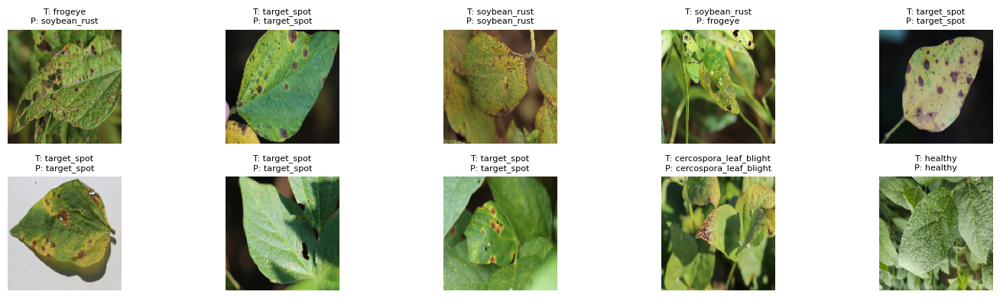

# Detecção de Doenças em Folhas de Soja com o Dataset ASDID

---

---

## Introdução

Este projeto apresenta o desenvolvimento de uma **CNN (Convolutional Neural Network)** para detecção e classificação de doenças em folhas de soja. O modelo é treinado de forma supervisionada com o dataset **ASDID**, contendo imagens de folhas de soja rotuladas em cinco classes: `healthy`, `frogeye`, `cercospora_leaf_blight`, `soybean_rust` e `target_spot`. A rede convolucional extrai automaticamente características visuais das folhas, enquanto técnicas de **data augmentation** são aplicadas para aumentar a robustez do modelo frente a variações de iluminação, posição e tamanho das folhas.

## Dataset

O dataset **ASDID** utilizado neste projeto está armazenado em formato `.npy` com dimensões `(N, 128, 128, 4)`, onde N representa o número de amostras, as três primeiras dimensões correspondem aos canais RGB e a quarta contém a classe da folha. As cinco classes presentes são:

* `healthy`: folha saudável
* `frogeye`: mancha ocular (frogeye leaf spot)
* `cercospora_leaf_blight`: cercosporiose
* `soybean_rust`: ferrugem da soja
* `target_spot`: mancha alvo

O dataset contém **5000 imagens balanceadas** e foi dividido em conjuntos de treino (90%) e validação (10%).

### Data Augmentation

Para aumentar a variedade de amostras e melhorar a generalização do modelo, foram aplicadas as seguintes transformações:

* Flip horizontal aleatório
* Rotação aleatória de até 10%
* Zoom aleatório de até 10%
* Ajuste de contraste de até 10%

### Arquivo `.npy` para Treinamento

Você pode carregar diretamente o arquivo `.npy` com o dataset:

🔗 [Download do dataset `dataset.npy` no Google Drive](https://drive.google.com/file/d/19NlnXMCGsX9uOP7ttoijoFh2vatFIpiQ/view?usp=sharing)

## Resultados

<strong>Resultados</strong>

  

O título das imagens indica a **classe real (T)** e a **classe prevista pelo modelo (P)**. A CNN atingiu acurácia consistente de validação de 83%, mostrando bom desempenho para identificação das doenças.

## Licença

Este projeto está licenciado sob a licença MIT - veja o arquivo LICENSE para detalhes.
